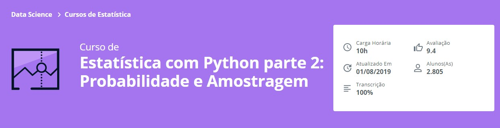

Repositório de desenvolvimento referente ao **Curso de Estatística com Python parte 2: Probabilidade e Amostragem - Alura**

## Aprendido no curso
* Entenda as distribuiçōes de binomial, poisson e normal
* Saiba o que o nível e intervalo de confiança
* Conheça técnicas de amostragem
* Calcule o tamanho da amostra

## Link para o Curso 
https://cursos.alura.com.br/course/estatistica-probabilidade-e-amostragem
